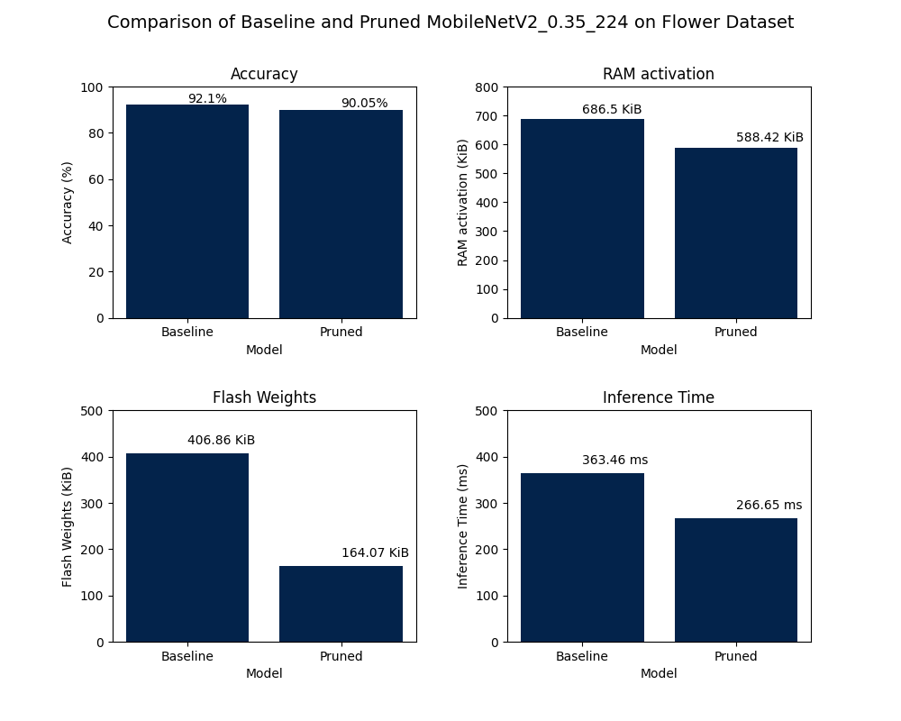

<h1> Image classification with STM32ai-nota  </h1>

Welcome to the image classification model pruning notebook with STM32ai-nota and NetsPresso. This directory contains the **netspresso_model_pruning.ipynb** notebook, which will guide you through the process of pruning your image classification models with NetsPresso, a structural pruning technique. Structural pruning involves removing entire neurons, channels, or filters from a neural network to reduce its size and complexity without sacrificing accuracy.

The table below provides some performances examples of quantized and pruned plus quantized models, as well as their memory footprints generated using STM32Cube.AI. All the footprints reported here are calculated chosing STM32H747I-DISCO board as target board, and can differ slightly when another target board is chosen. 
By default, the results are provided for quantized Int8 models with and without pruning applied. 


| Models                       |  Dataset          | Input Resolution | Top 1 Accuracy (%) | Inference Time (ms) | Activation RAM (KiB) | Weights Flash (KiB) | STM32Cube.AI version | Source                                                                                                                                            |
|------------------------------|------------------|------------------|--------------------|--------------|----------------------|---------------------|----------------------|---------------------------------------------------------------------------------------------------------------------------------------------------|
| MobileNet v1 0.5 | Flowers | 224x224x3 | 91.96 | 524.41 | 404.66 | 812.61 | 8.1.0 | [link](pretrained_models/mobilenetv1/flowers/baseline_model/mobilenet_v1_0.5_224_int8.tflite)                   |
| MobileNet v1 0.5 pruned | Flowers | 224x224x3 | **90.46** | <span style="color:#03234B"> **284.01** | <span style="color:#03234B"> **404.66** | <span style="color:#03234B"> **197.34** | 8.1.0 | [link](pretrained_models/mobilenetv1/flowers/pruned_model/mobilenet_v1_0.5_224_int8_pruned.tflite) |
| MobileNet v2 0.35 | Flowers | 224x224x3 | 92.10 | 363.62  | 686.5 | 406.86 | 8.1.0 | [link]()                 |
| MobileNet v2 0.35 pruned | Flowers | 224x224x3 | **90.05** | <span style="color:#03234B"> **266.65** | <span style="color:#03234B"> **588.42** | <span style="color:#03234B"> **164.07** | 8.1.0 | [link]() |
| MobileNet v1 0.25 | Plant-village | 224x224x3 | 99.89 | 277.3 | 588.42 | 164.16 | 8.1.0 | [link](pretrained_models/mobilenetv1/plant_village/baseline_model/mobilenet_v1_0.25_224_int8.tflite)                   |
| MobileNet v1 0.25 pruned | Plant-village | 224x224x3 | **99.77** | <span style="color:#03234B"> **112.57** | <span style="color:#03234B"> **202.33** | <span style="color:#03234B"> **58.66** | 8.1.0 | [link](pretrained_models/mobilenetv1/plant_village/pruned_model/mobilenet_v1_0.25_224_int8_pruned.tflite) |
| MobileNet v2 0.35 | Plant-village | 224x224x3 | 99.73 | 364.76 | 686.5 | 449.5 | 8.1.0 | [link](pretrained_models/mobilenetv2/plant_village/baseline/mobilenet_v2_0.35_224_int8.tflite)|
| MobileNet v2 0.35 pruned | Plant-village | 224x224x3 | **99.82** | <span style="color:#03234B"> **277.44** | <span style="color:#03234B"> **588.42** | <span style="color:#03234B"> **164.16** | 8.1.0 | [link](pretrained_models/mobilenetv2/plant_village/pruned/mobilenet_v2_0.35_224_int8_pruned.tflite) |
| SqueezeNet v1.1 | Plant-village | 224x224x3 | 99.76 | 870.79 | 842.06 | 733.84 | 8.1.0 | [link](pretrained_models/squeeznetv1.1/plant_village/baseline_model/squeezenetv1.1_128_tfs_int8.tflite)                   |
| SqueezeNet v1.1 pruned | Plant-village | 224x224x3 | **99.56** | <span style="color:#03234B"> **475.26** | <span style="color:#03234B"> **645.65** | <span style="color:#03234B"> **240.57** | 8.1.0 | [link](pretrained_models/squeeznetv1.1/plant_village/pruned_model/squeezenetv1.1_128_tfs_int8_pruned.tflite) |


# Before you start

To use the notebook, assuming that the "Before You Start" section in the [README](../README.md) file has been followed and that your virtual environment is activated, you can either use your favorite IDE like VSCode or run the notebook using the following steps:

If using VSCode:

1. Open the notebook file in VSCode.
2. Click on the "Select Kernel" button in the top right corner of the notebook.
3. Choose <env-name> as the kernel for the notebook, then start executing the notebook by cell.

Alternatively, you can run the notebook using the following steps:

1. Install the ipykernel and jupyter packages in your virtual environment using the command:
```
pip install ipykernel jupyter
```
2. Register your virtual environment as a kernel by running the following command:
```
python -m ipykernel install --user --name=<env-name>
```
3. Launch Jupyter Notebook using the command:
```
jupyter notebook
```
4. Click on the "Kernel" menu and select your virtual environment from the list of available kernels and start executing the notebook by cell.


# The Pruning Process

To achieve results similar to those presented in the table above for the pruned model, you will need to use the **netspresso_model_pruning.ipynb** notebook, as well as the **config_files** folder. The **config_files** folder contains configuration files for NetsPresso, while the **experiments_outputs** directory stores the output files generated during the pruning process. The notebook will guide you through the following steps:

1. Train a baseline model from the STM32 model zoo or your Keras model, quantize it, and evaluate its performance. 
2. Benchmark the baseline model using our STM32Cube.AI Developer Cloud.
3. Prune the model to reduce its size and complexity using NetsPresso.
4. Fine-tune the pruned model to recover any lost accuracy.
5. Quantize the model to reduce its memory footprint and improve inference speed.
6. Benchmark the model to compare its performance before and after pruning and quantization.

# Output Files

For each experience, an experiment directory is created that contains all the directories and files created during the run under **experiments_outputs**, some of the created directories are illustrated in the figure below following netspresso_model_pruning.ipynb notebook provided as an example.

```
                                         experiments_outputs
                                                |
                                                |
      +--------------+--------------------------+---------------------+---------------------+-----------------------+
      |              |                          |                     |                     |                       |
      |              |                          |                     |                     |                       |
    mlruns     pruned_models            Baseline_training    Baseline_benchmarking    pruned_fine_tuning   pruned_quantization  
      |              |                          |                     |               pruned_evaluation             |
      |              |                          |                     |              pruned_benchmarking            |
      |          PR_L2_0.5                      |                     +-- stm32ai_main.log                  quantized_models 
    MLflow           |                          +-- stm32ai_main.log                                                |
    files            +-- PR_L2_0.5.h5           +-- training_metrics.csv                                            +-- quantized_model.tflite
                     +-- metadata.json          +-- training_curves.png
                                                +-- float_model_confusion_matrix_validation_set.png
                                                +-- quantized_model_confusion_matrix_validation set.png
                                                |
      +-----------------------------------------+--------------------------------+------------+
      |                                         |                                |            |
      |                                         |                                |            |
 saved_models                            quantized_models                       logs        .hydra
      |                                         |                                |            |
      +-- best_augmented_model.h5               +-- quantized_model.tflite   TensorBoard     Hydra
      +-- last_augmented_model.h5                                               files        files
      +-- best_model.h5

```

# Results

The image below illustrates the performance comparison between the baseline model and the pruned model, which has been pruned at a ratio of 0.5, following the netspresso_model_pruning.ipynb notebook provided as an example. As observed, the pruned model retains accuracy comparable to that of the baseline model, while significantly reducing both the memory footprint and the inference time.




